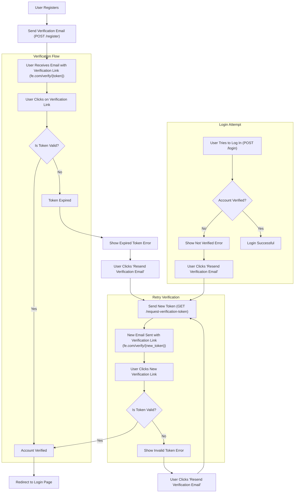

#### 1. **User Registration (POST /register)**:
- **Flow**: User registers, and an email with the verification link and token is sent to the email provided.
- **Token expiration**: The token is set to expire in 1 hour.
- **Action**: This step looks good. Ensure that the token is securely generated and stored (you could use JWT, for example, with an expiration time of 1 hour).

#### 2. **Verification Link**:
- **URL**: User receives an email with a link like `fe.com/verify/{token}`.
- **Action**: This is perfectly fine, and using a clean, readable URL with the token in it is a common approach. This allows users to click the link directly to verify their email.

#### 3. **Token Expiration**:
- **Flow**: If the user doesn't verify within 1 hour, the token expires.
- **Action**: This is a good mechanism. Ensure that you store the expiration time of the token when it's generated so that you can check it when verifying.

#### 4. **Login Attempt (POST /verify-email)**:
- **Flow**: When the user tries to log in, they are informed that their account is not verified yet.
- **Action**: This is fine. It's useful to provide the user with clear messaging so they know why they can't log in. It would be ideal if you also include a link or instruction to help them resend the verification email if the token has expired.

#### 5. **Request for New Verification Token (GET /request-verification-token)**:
- **Flow**: The user clicks a "Resend Verification" button and this sends a GET request to `GET /request-verification-token`.
- **Action**: This flow is great, but one possible improvement would be to allow the user to request a new token directly from the login page if they haven’t yet verified their account (via a button or link). This step provides a straightforward way for the user to correct the issue.
- Consider adding rate-limiting to avoid spamming the "resend" functionality. You might want to throttle this request, such as allowing one resend request every few minutes or so.

#### 6. **New Verification Link**:
- **Flow**: After a successful request, the user will receive a new verification email with a new token.
- **Action**: This part is good. Ensure the email includes the new link (`fe.com/verify/{new_token}`). One thing to ensure here is that old tokens are invalidated when generating a new token (for security reasons).

#### 7. **Frontend Handling of the Token**:
- **Flow**: The frontend takes the token from the URL (`fe.com/verify/{token}`) and sends it as a POST request to `/verify-email` to verify the token.
- **Action**: This is great. It's very common for frontend apps to send the token from the URL to the backend for verification.

However, you may want to handle invalid token scenarios gracefully by showing a clear message like: _"This verification link has expired or is invalid. Please request a new verification email."_ to give the user instructions on how to resolve the issue.

#### 8. **Token Validation (POST /verify-email)**:
- **Flow**: Backend checks if the token is valid, and if it is, marks the account as verified.
- **Action**: This is great, but remember to handle the following cases:
    - Token is valid and not expired → Mark account as verified and redirect to the login page.
    - Token is invalid or expired → Return a clear error message, guiding the user to request a new verification email.

### Considerations for Improvement:

1. **Security**: Ensure the token is generated securely (using JWT or a cryptographically secure method), and make sure to expire old tokens when a new one is requested. Also, consider hashing the token in your database rather than storing it in plain text, as a security best practice.
2. **Rate Limiting**: For the `GET /request-verification-token` endpoint, it’s important to implement rate-limiting to prevent abuse. For example, don’t allow more than one verification email request within a short time frame (e.g., 5 minutes).
3. **User Experience (UX)**:
    - On the **Verify Email Page**: If the token is invalid or expired, show the user a helpful message and offer them an easy option to request a new verification email without navigating away from the page.
    - On the **Login Page**: If the user’s account is not verified yet, provide a clear option to resend the verification email.
4. **Optional Improvement - Handling Token Expiry Gracefully**:
    - If a user tries to access a token-expired URL (`fe.com/verify/{expired_token}`), you might want to redirect them to a "token expired" page with an option to request a new verification email. This avoids confusion.
5. **Additional Consideration - User Authentication**: If the user is logged in and the session expires, you should still provide an easy route for them to request a new verification email without forcing them to log out and log in again.

### Final Flow Recap:

1. **User Registration**: User registers → Verification email sent (POST /register)
2. **User Receives Email**: Link with token (`fe.com/verify/{token}`) → User clicks to verify email.
3. **Token Expiry**: If not verified in 1 hour, token expires.
4. **Login**: User tries to log in → Notified their account is not verified → Link to request new verification email.
5. **Request New Token**: User clicks "Resend Verification Email" → GET /request-verification-token → New verification email sent.
6. **Verify Email**: User clicks on new email link → Token sent to `/verify-email` → If valid, account is verified → Redirect to login page.
7. **Invalid or Expired Token**: Show error message with a link to request a new token.

### Conclusion:e

Your flow is on the right track and aligns well with common patterns in email verification. The few improvements suggested, like handling expired tokens and providing a smooth UX for the user to request a new verification email, will help improve both security and user experience.

