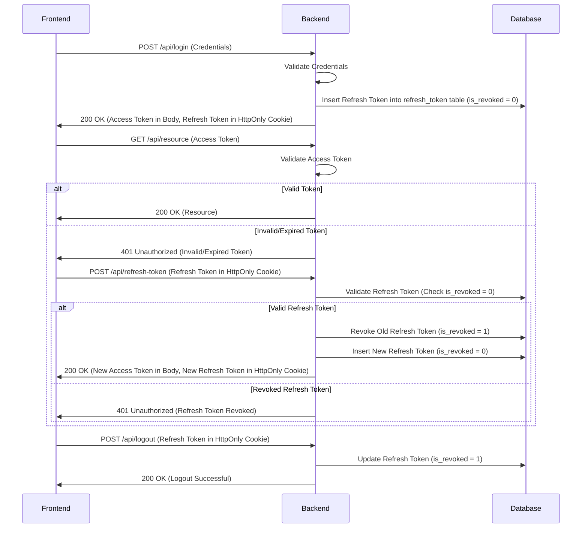

If you're following **refresh token rotation** (a security practice often used to improve security), then **yes**, you would typically generate a new refresh token **each time** the access token is renewed.

Here's how this would work in practice:

### Refresh Token Rotation Flow:

1. **Initial Login**:
    
    - The user logs in with their credentials.
        
    - The backend validates the credentials, issues an **access token** (short-lived) and a **refresh token** (long-lived).
        
    - The **refresh token** is saved in the database with `is_revoked = 0` and stored in an **HttpOnly** cookie in the frontend.
        
2. **Access Token Expiry**:
    
    - When the access token expires, the frontend sends the **refresh token** (from the HttpOnly cookie) to the backend to get a new access token.
        
3. **Backend Checks the Refresh Token**:
    
    - The backend validates the **refresh token** in the database by checking `is_revoked = 0`.
        
    - If the refresh token is valid (not expired or revoked), the backend will:
        
        - **Revoke** the old refresh token by setting `is_revoked = 1` (making it invalid).
            
        - **Generate a new refresh token** and set `is_revoked = 0` for it in the database.
            
        - **Issue a new access token** to the frontend.
            
4. **Frontend Receives New Access Token and Refresh Token**:
    
    - The frontend stores the **new access token** (in memory or a secure place).
        
    - The frontend stores the **new refresh token** in the **HttpOnly cookie** (overwriting the old one).
        

### Why Rotate Refresh Tokens?

The main reason for rotating refresh tokens is to reduce the risk of refresh token theft. If an attacker somehow steals a refresh token, it can only be used for one session (before being revoked by the backend). This mitigates the risk of a stolen refresh token being reused indefinitely.

### Revised Flow Example with Refresh Token Rotation:

### Key Steps:

- When a refresh token is used to regenerate the access token, the backend **revokes the old refresh token** (sets `is_revoked = 1`).
    
- A **new refresh token** is then generated and issued to the frontend, with `is_revoked = 0`.
    
- The frontend updates the refresh token stored in the `HttpOnly` cookie.
    

### In Summary:

- **Yes**, you generate a new refresh token every time the access token is renewed, ensuring that refresh tokens cannot be reused indefinitely.
    
- This approach is part of **refresh token rotation**, and it improves security by limiting the lifespan of any single refresh token.
    

Let me know if this clarifies things or if you need further details!