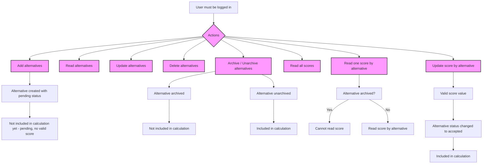

Protected Route - User Personalized Data
(alternatives related)
1. add alternatives -> alterantives created with pending status, not included at calculation yet because it hasnt valid score value
2. read alternatives
3. update alternatives
4. delete alternatives
5. archive / unarchived alternatives -> alternative archived and not included in calculation vice versa

(score related)
1. read all scores
2. read one score by alternative -> if alternative archived it wont read
3. update score by alternative -> alternatives updated with valid score value + status change to accepted, included in calcultion

