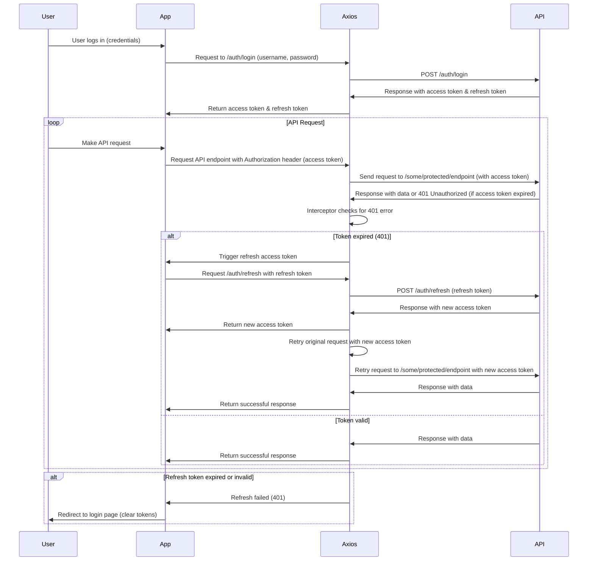

You're correct that creating the same check for **access token expiration** and **refreshing** the token in every endpoint can become repetitive. Fortunately, you can centralize this logic in a more efficient and scalable way by using **Axios interceptors** and **React Query's global configuration**.

### Best Approach:

The best approach is to **centralize the logic** for handling token expiration, refresh, and retrying requests by using an **Axios interceptor** for the token refresh logic. This way, you only need to write the logic once, and it will be applied to all requests made via Axios.

Additionally, **React Query** can handle the mutation for refreshing the token and ensure that the logic is applied globally.

### Centralized Axios Interceptor for Token Refresh:

By using an **Axios interceptor**, you can catch the `401 Unauthorized` response and refresh the token automatically for all requests.

### Example:

1. **Axios Setup with Interceptor:**
    

Here, we will create an Axios instance and set up a request and response interceptor that will handle access token expiration.

#### Axios Instance (with interceptor for token refresh):

```javascript
// axios.js
import axios from 'axios';
import { useHistory } from 'react-router-dom';
import { useMutation } from '@tanstack/react-query';
import { refreshToken } from './useRefreshToken';  // Assume you have a hook for refreshing token

const axiosInstance = axios.create({
    baseURL: 'https://api.yourapp.com',
    headers: {
        'Content-Type': 'application/json',
    },
});

// Request interceptor to add Authorization header to each request
axiosInstance.interceptors.request.use(
    (config) => {
        const token = localStorage.getItem('access_token'); // or wherever you store your access token
        if (token) {
            config.headers['Authorization'] = `Bearer ${token}`;
        }
        return config;
    },
    (error) => Promise.reject(error)
);

// Response interceptor to handle 401 errors and refresh token if expired
axiosInstance.interceptors.response.use(
    response => response, // If the response is successful, just return it
    async (error) => {
        const originalRequest = error.config;

        // If we get a 401 Unauthorized error and haven't tried refreshing already
        if (error.response.status === 401 && !originalRequest._retry) {
            originalRequest._retry = true;

            try {
                // Use React Query's mutation to refresh the access token
                const newAccessToken = await refreshAccessToken();
                localStorage.setItem('access_token', newAccessToken); // Store the new token

                // Update the original request's Authorization header with the new token
                originalRequest.headers['Authorization'] = `Bearer ${newAccessToken}`;

                // Retry the original request with the new token
                return axiosInstance(originalRequest);
            } catch (err) {
                // If refresh fails, log out the user and redirect to login
                localStorage.removeItem('access_token');
                window.location.href = '/login';  // You can use react-router's navigate() here if needed
                return Promise.reject(err);
            }
        }

        // For any other errors, just reject the promise
        return Promise.reject(error);
    }
);

export default axiosInstance;
```

#### Refresh Token Mutation Hook (React Query):

```javascript
// useRefreshToken.js
import { useMutation } from '@tanstack/react-query';
import axiosInstance from './axios';  // Your Axios instance

const refreshAccessToken = async () => {
    const response = await axiosInstance.post('/auth/refresh'); //Assuming your refresh token endpoint is at `/auth/refresh`
    return response.data.access_token;  // Assuming response contains new access token
};

const UseRefreshToken = () => {
    return useMutation(refreshAccessToken);
};

export { refreshAccessToken, UseRefreshToken };
```

#### Using Axios Instance and React Query in Components:

You can now use the `axiosInstance` for your API calls, and it will handle the token refresh logic centrally.

```javascript
// SomeComponent.js
import React, { useEffect } from 'react';
import { useQuery } from '@tanstack/react-query';
import axiosInstance from './lib/axios';  // Axios instance with interceptors

const SomeComponent = () => {
    const { data, error, isLoading } = useQuery(['someData'], async () => {
        const response = await axiosInstance.get('/some/protected/endpoint');
        return response.data;
    });

    if (isLoading) return <div>Loading...</div>;
    if (error) return <div>Error occurred!</div>;

    return (
        <div>
            <h1>Data:</h1>
	        <pre>{JSON.stringify(data, null, 2)}</pre>
        </div>
    );
};

export default SomeComponent;
```

### How This Works:

1. **Axios Interceptors**:
    
    - **Request Interceptor**: Before sending a request, the interceptor checks if there's an access token and attaches it to the `Authorization` header.
        
    - **Response Interceptor**: If a `401 Unauthorized` error occurs, the interceptor will attempt to refresh the token using the `refreshAccessToken` mutation, and then retry the original request with the new access token.
        
2. **Token Refresh Logic**:
    
    - The `refreshAccessToken` function is used to send a request to your `/auth/refresh` endpoint and get a new access token.
        
    - If the refresh token is expired or invalid, the user is logged out and redirected to the login page.
        
3. **React Query**:
    
    - You use React Query's `useQuery` and `useMutation` to make API calls. These queries will automatically handle token expiration and refresh without needing to manually add token refresh logic to each individual request.
        
4. **Handling Redirection**:
    
    - When the refresh token fails (e.g., the refresh token is expired or invalid), the user is logged out by clearing the access token from storage and redirected to the login page.
        

### Advantages of This Approach:

- **Centralized Logic**: You only write the token refresh logic once (in the Axios interceptor), and it's applied to all requests automatically.
    
- **No Repetition**: You don't need to repeat token refresh logic in each API call. The interceptor handles it globally.
    
- **Automatic Token Refresh**: Axios will automatically retry failed requests after refreshing the token, providing a seamless user experience.
    
- **React Query Integration**: React Query's hooks can handle API requests and data caching efficiently while the Axios interceptor manages token expiration.
    

---

### Summary:

By using **Axios interceptors** for handling token expiration and refresh logic, you centralize the logic and avoid having to repeat it for every individual request. This ensures a cleaner, more maintainable approach and provides a seamless user experience for authentication and authorization in your application.

Certainly! Here's a flow diagram using **Mermaid** to represent the process of handling token expiration, refreshing the token, and retrying the request:



### Flow Explanation:

1. **User Logs In**:
    
    - The user logs in by providing credentials, and the app sends a request to `/auth/login` to authenticate the user. The server responds with an **access token** and a **refresh token**.
        
2. **API Request**:
    
    - The user makes a request to a protected API endpoint. The **access token** is sent in the `Authorization` header.
        
    - If the **access token** is valid, the server responds with data.
        
    - If the **access token** has expired, the server returns a `401 Unauthorized` error.
        
3. **Token Expiration Handling**:
    
    - The **Axios interceptor** checks for the `401 Unauthorized` response. If the token is expired, it triggers a **refresh token** request to `/auth/refresh` with the **refresh token**.
        
    - If the **refresh token** is valid, the server responds with a new **access token**.
        
    - The original request is then retried with the new **access token**.
        
4. **Token Valid Handling**:
    
    - If the **access token** is still valid, the API responds with the requested data.
        
5. **Refresh Token Expired Handling**:
    
    - If the **refresh token** is expired or invalid, the **Axios interceptor** triggers a redirection to the login page and clears the authentication tokens.
        

This flow helps visualize how Axios interceptors and token management work together with React Query to handle token expiration and automatic refresh.